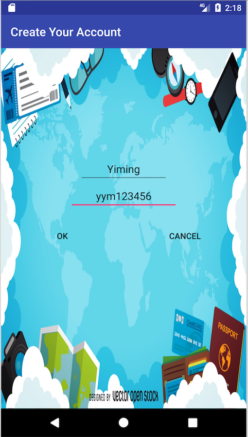
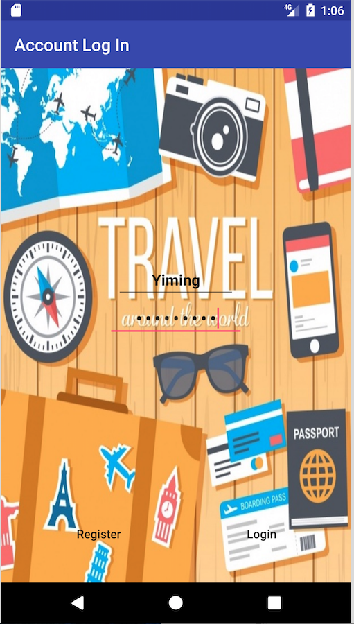
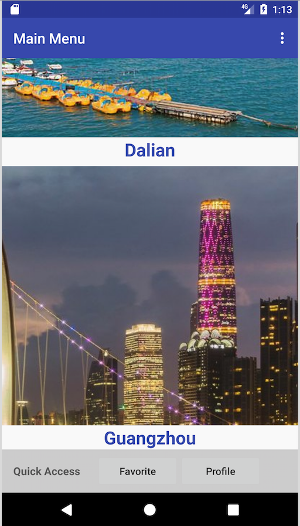
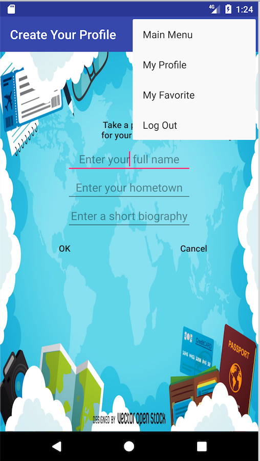
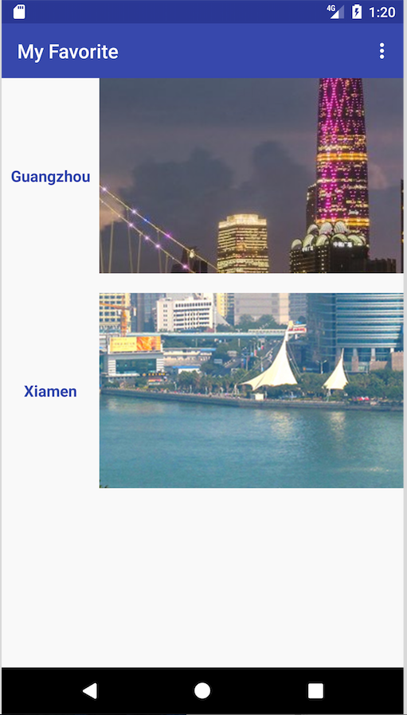
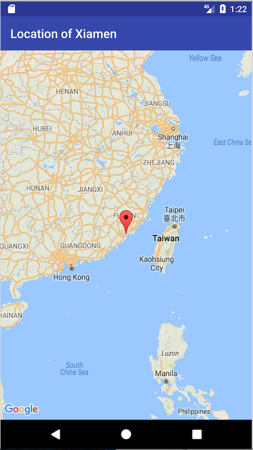

# Travelling Tip App
## Description
Provide tips for travelling to various cities by showing their distinct features through views of locally traditional plates and places of interest. Users can create accounts, create/update profiles and favorite places interested in for further travelling plans while navigating app. App data including users’ information is managed by SQLite database

## Functionality
### Create a new account

### Login

### Robust password checking

### Main Menu with navigation Menu (upper right)

### Create your profile

### Update your profile at any time

### Preview of a city

### Like this city, unlike by re-clicking

### View cities that you have liked

### Check out the traditional food in this city

### Check out its place of interest

### View location on Map

### Have Fun!